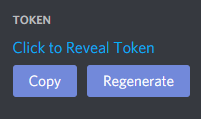
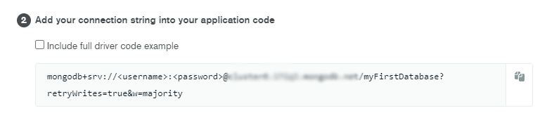
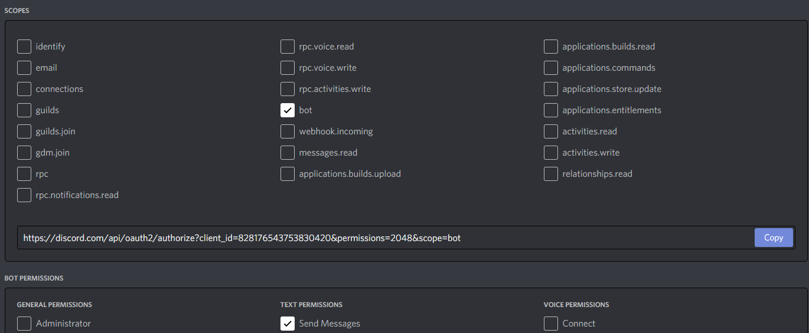

<!--
*** Thanks for checking out the Best-README-Template. If you have a suggestion
*** that would make this better, please fork the repo and create a pull request
*** or simply open an issue with the tag "enhancement".
*** Thanks again! Now go create something AMAZING! :D
***
***
***
*** To avoid retyping too much info. Do a search and replace for the following:
*** github_username, repo_name, twitter_handle, email, project_title, project_description
-->


<!-- PROJECT SHIELDS -->
<!--
*** I'm using markdown "reference style" links for readability.
*** Reference links are enclosed in brackets [ ] instead of parentheses ( ).
*** See the bottom of this document for the declaration of the reference variables
*** for contributors-url, forks-url, etc. This is an optional, concise syntax you may use.
*** https://www.markdownguide.org/basic-syntax/#reference-style-links
-->
[![Contributors][contributors-shield]][contributors-url]
[![Forks][forks-shield]][forks-url]
[![Stargazers][stars-shield]][stars-url]
[![Issues][issues-shield]][issues-url]
[![MIT License][license-shield]][license-url]
[![LinkedIn][linkedin-shield]][linkedin-url]


<!-- PROJECT LOGO -->
<br />
<p align="center">
  <a href="https://github.com/github_username/repo_name">
    
  </a>

  <h3 align="center">RandBot</h3>

  <p align="center">
    Discord bot randomizer. Users can create a list that is stored in MongoDB and the bot can select a random item from this list.
    <a href="https://discord.com/api/oauth2/authorize?client_id=830397927125286922&permissions=2048&scope=bot">Invite bot</a>
    ·
    <a href="https://github.com/karlji/RandBot-Discord-Randomizer/issues">Report Bug</a>
    ·
    <a href="https://github.com/karlji/RandBot-Discord-Randomizer/issues">Request Feature</a>
  </p>
</p>


<!-- TABLE OF CONTENTS -->
<details open="open">
  <summary><h2 style="display: inline-block">Table of Contents</h2></summary>
  <ol>
    <li>
      <a href="#about-the-project">About The Project</a>
      <ul>
        <li><a href="#built-with">Built With</a></li>
      </ul>
    </li>
    <li>
      <a href="#getting-started">Getting Started</a>
      <ul>
        <li><a href="#prerequisites">Prerequisites</a></li>
        <li><a href="#installation">Installation</a></li>
      </ul>
    </li>
    <li><a href="#commands">Bot Commands</a></li>
    <li><a href="#roadmap">Roadmap</a></li>
    <li><a href="#contributing">Contributing</a></li>
    <li><a href="#license">License</a></li>
    <li><a href="#contact">Contact</a></li>
  </ol>
</details>


<!-- ABOUT THE PROJECT -->
## About The Project

Discord bot created in Python using [discord.py](https://discordpy.readthedocs.io/).
The bot can create custom lists using the ?list command and stores those lists in MongoDB.
Those lists can also be deleted using the command ?delete.
Bot returns 1 random item from the selected list when command ?random is used.

The project is now in the beta version. This is the first working version that I am using on my Discord server to randomize drop location in Call of Duty: Warzone.
It is currently working, but error handling should be updated and new features can be added. This was a fun project to use on my Discord, but I have decided to share it with others. I am currently hosting the bot as well, so you can also invite the bot to your server instead of running it on your own.


### Built With

* [Python](https://www.python.org/)
* [MongoDB](https://www.mongodb.com/)


<!-- GETTING STARTED -->
## Getting Started

There are 2 options:
1) Only inviting my bot to your server. You can use [this link](https://discord.com/api/oauth2/authorize?client_id=830397927125286922&permissions=2048&scope=bot).
2) Download the repository and creating the MongoDB Atlas database. More details in the Installation section.

### Prerequisites

- [Python 3](https://www.python.org/)
- Following Python modules are needed. I recommend installing them with [pip](https://pip.pypa.io/en/stable/installing/):
  - [discord](https://discordpy.readthedocs.io/)
  - [pymongo](https://pymongo.readthedocs.io/)
  - [asyncio](https://docs.python.org/3/library/asyncio.html)
  - [dnspython](https://www.dnspython.org/)
- [MongoDB Atlas](https://www.mongodb.com/cloud/atlas) - There is free database option. I am currently using following DB structure "bot.lists", which is also part of the code in commands.py. It can be changed there:
   ```sh
  db = clientDB.bot
  collection = db.lists
  ```


### Installation

1. Clone the repo
   ```sh
   git clone https://github.com/karlji/RandBot-Discord-Randomizer.git
   ```
2. Create Discord bot on [Discord Developer Portal](https://discord.com/developers/docs/intro) & store the bot token to tokens.py
    - 
4. Create [MongoDB Atlas cluster](https://www.mongodb.com/cloud/atlas) with DB structure "bot.lists", add IP adress of your bot machine, copy "connection string" to tokens.py
    - 
5. Run randbot.py
6. Create OAuth2 link on [Discord Developer Portal](https://discord.com/developers/). Options "bot" and "send messages" should be enough. This link can be used to invite bot to Discord servers.
    - 


<!-- COMMANDS -->
## Commands

Following commands are available:

- ?list {ListName}
  - Creates new list.
- ?shuffle {ListName}
  - Randomly selects one item from list.
- ?delete {ListName}
  - Deletes existing list.
- ?commands
  - Lists all available commands.

<!-- ROADMAP -->
## Roadmap

See the [open issues](https://github.com/github_username/repo_name/issues) for a list of proposed features (and known issues).


<!-- CONTRIBUTING -->
## Contributing

Contributions are what makes the open source community such an amazing place to learn, inspire, and create. Any contributions you make are **greatly appreciated**.

1. Fork the Project
2. Create your Feature Branch (`git checkout -b feature/AmazingFeature`)
3. Commit your Changes (`git commit -m 'Add some AmazingFeature'`)
4. Push to the Branch (`git push origin feature/AmazingFeature`)
5. Open a Pull Request


<!-- LICENSE -->
## License

Distributed under the MIT License. See `LICENSE` for more information.


<!-- CONTACT -->
## Contact

Jiri Karlik- [Linkedin](https://www.linkedin.com/in/jiri-karlik/)

Project Link: [https://github.com/karlji/RandBot-Discord-Randomizer](https://github.com/karlji/RandBot-Discord-Randomizer)


<!-- MARKDOWN LINKS & IMAGES -->
<!-- https://www.markdownguide.org/basic-syntax/#reference-style-links -->
[contributors-shield]: https://img.shields.io/github/contributors/karlji/RandBot-Discord-Randomizer.svg?style=for-the-badge
[contributors-url]: https://github.com/karlji/RandBot-Discord-Randomizer/graphs/contributors
[forks-shield]: https://img.shields.io/github/forks/karlji/RandBot-Discord-Randomizer.svg?style=for-the-badge
[forks-url]: https://github.com/karlji/RandBot-Discord-Randomizer/network/members
[stars-shield]: https://img.shields.io/github/stars/karlji/repo.svg?style=for-the-badge
[stars-url]: https://github.com/karlji/RandBot-Discord-Randomizer/stargazers
[issues-shield]: https://img.shields.io/github/issues/karlji/RandBot-Discord-Randomizer.svg?style=for-the-badge
[issues-url]: https://github.com/karlji/RandBot-Discord-Randomizer/issues
[license-shield]: https://img.shields.io/github/license/karlji/RandBot-Discord-Randomizer.svg?style=for-the-badge
[license-url]: https://github.com/karlji/RandBot-Discord-Randomizer/blob/master/LICENSE.txt
[linkedin-shield]: https://img.shields.io/badge/-LinkedIn-black.svg?style=for-the-badge&logo=linkedin&colorB=555
[linkedin-url]: https://www.linkedin.com/in/jiri-karlik/
